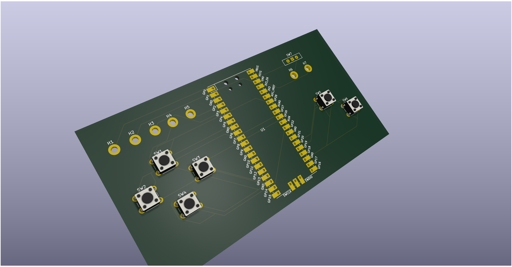
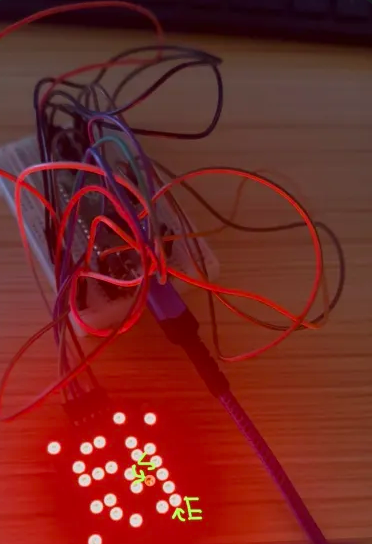

# LED Matrix Maze – Custom PCB Project

- **Tools:** KiCad, Raspberry Pi, MAX7219, Thonny IDE and VSCode
- **Focus:** PCB Design, Embedded Systems, Interactive Hardware

## Overview
This project implements an interactive LED matrix maze system using a custom
PCB designed in KiCad. The board integrates an LED driver, microcontroller
interface, and user inputs, and is designed for makerspace prototyping and
iteration.

## Prototyping
Before PCB design, the circuit was validated using a breadboard prototype
to test LED matrix control, button inputs, and maze logic. This prototype was
used to verify functionality prior to committing to fabricating the PCB.

## Fabrication Plan
The PCB is designed for rapid prototyping using professional PCB milling and
laser equipment available through the GT Hive makerspace. The design is prepared
for fabrication on an LPKF ProtoMat S103 and ProtoLaser U4 system, enabling fast
iteration and testing prior to final assembly.

## What I Did
- Integrated a MAX7219 LED driver with a Raspberry Pi Pico via SPI, including
  button input circuitry for user interaction
- Designed schematics and PCB layout in KiCAD with userfriendlyness and functionality in mind
- Implemented recursive backtracking maze generation algorithm

## Key Challenges
- Addressed signal integrity issues in SPI communication through impedance matching
- Designed custom multiplexing logic to work within MAX7219's binary (on/off) output limitation for monochrome LED control

## Repository Structure
- `/renders` – 3D PCB renders
- `/photos` – Assembled board photos
- `/schematic` – Schematics
- `/pcb` – PCB layout files
- `/code` – Firmware and control logic

## Status
Design complete and ready for fabrication in January when spring semester starts.
